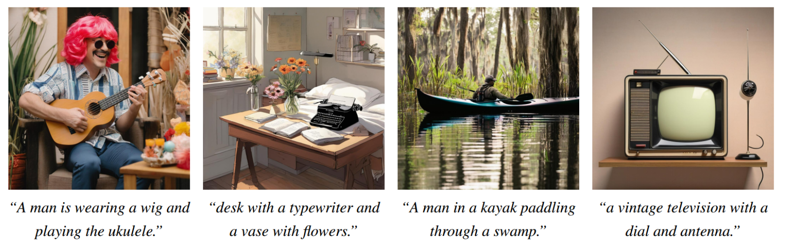
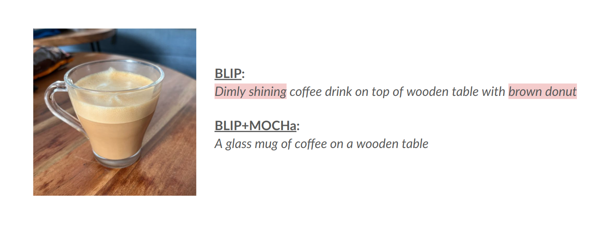

# Mitigating Open-Vocabulary Caption Hallucinations

<p align="center">

<a href="https://assafbk.github.io/website/">Assaf Ben-Kish</a>,
<a href="">Moran Yanuka</a>,
<a href="https://morrisalp.github.io/">Morris Alper</a>,
<a href="https://www.giryes.sites.tau.ac.il/">Raja Giryes</a>,
<a href="https://www.elor.sites.tau.ac.il/">Hadar Averbuch-Elor</a>

<a href="https://assafbk.github.io/mocha"></a>
<a href="https://arxiv.org/abs/2312.03631"></a>

Hallucinated details are prevalent in the outputs of modern image captioning models. Prior work has largely focused on detecting or mitigating hallucinations by using closed-vocabulary object lists, which simplify the problem but fail to capture most types of hallucinations that occur in practice. By leveraging recent progress in generative foundation models, we propose a unified framework for quantifying and mitigating open-vocabulary hallucinations. <br>

First, We introduce <b>OpenCHAIR</b>, a benchmark for evaluating open-vocabulary hallucinations which surpasses the existing benchmark CHAIR both in diversity and accuracy:<br>

  

Additionally, we introduce <b>MOCHa</b>, a reinforcement learning-based approach that adjusts captioning models to output detailed, valid captions while avoiding such hallucinations:

  

</p>
<br>

# Setup
## Clone Project
```
git clone https://github.com/assafbk/mocha_code.git
cd mocha_code
```

## Create Environment
To set up our environment, please run:
```
conda env create -f environment.yml
conda activate mocha
python -m spacy download en_core_web_sm
```
<br>

# Measure Open-Vocabulary Hallucination Rate With The OpenCHAIR Benchmark

To perform evaluation over the OpenCHAIR benchmark:
1. Create a csv file with a single column titled 'generated_caption'. The following rows should contain the model's captions for OpenCHAIR's images.
   An example csv file can be found in:<br>
   ```OpenCHAIR/example_gen_file.csv```

   Additionally, we provide a script for generating such a file for the MOCHa-optimized BLIP-Base model, by running:

    ```Shell
    python OpenCHAIR/generate_captions.py \
        --model-ckpt moranyanuka/blip-image-captioning-base-mocha \
        --prompt "a photography of " \
        --batch-size 100
        --num-beams 5
    ```
    Additional information:

    * ```model-ckpt```: The huggingface ckeckpoint of the model to be evaluated. Note that the script currently only supports BLIP-Base and BLIP-Large based models.
    * ```prompt```: The prompt appended for the generation

3. Download the Concreteness Rating Dataset (xlsx format) from [here](https://github.com/ArtsEngine/concreteness).

4. Run the evaluation script:

    ```Shell
    python OpenCHAIR/evaluate.py \
        --concreteness-dataset-path <path-to-concreteness-dataset> \
        --generations-file-path <path-to-generated-captions-file>
    ```

More configuration options can be found in ```OpenCHAIR/evaluate.py```


The OpenCHAIR dataset can also be accessed from [🤗 Here](https://huggingface.co/datasets/moranyanuka/OpenCHAIR), and can be loaded as follows:
```python
from datasets import load_dataset
dataset = load_dataset("moranyanuka/OpenCHAIR")['test']
```

## Tips:
* selecting a large ```--batch-size``` can significantly improve the evaluation script's runtime.
<br>


# Fine-Tune A Vision-Language Model With The MOCHa Framework
We currently support BLIP-Large on the MS-COCO Dataset (will add support for other models and datasets in the near future).

To run the training script:
```
python vlm_rlhf.py
```

The configuration file is ```vlm_rlhf_config.json```. Important configurations:
* ```reward_model_weights```: List of weights for all rewards. First is the NLI weight and the second is the BERTScore weight (equivalent to alpha and 1-alpha in the paper). This field tunes the pareto frontier of the fidelity-adequacy curve. Initialized to [0.5,0.5].
* ```beta```: The weight for the kl-penalty reward. Initialized to 0.06.
* ```num_of_images_per_batch```: Number of images per PPO batch. Initialized to 10.
* ```num_of_samples_per_image```: Number of captions to generate per image. Initialized to 10. <br>In a single batch there are <num_of_images_per_batch> x <num_of_samples_per_image> captions.
* ```model_device```, ```ref_model_device```, ```reward_model_device```: Cuda device for each model.

All training metrics, including caption samples (for train and verification images) are displayed in the wandb webpage.

Additional configurations:
* ```output_dir```: Where to save model checkpoints. Initialized to <project_dir>/output.
* ```cache_dir```: Huggingface cache dir for all models. Initialized to <project_dir>/hf_cache.
* ```activate_logging```: Enables wandb logging. Initialized to True.
* ```sampling_temperature```: Sampling temperature for the model. Initialized to 1.2.   
* ```save_steps```: Model saving interval. Initialized to 200 (Note: best model is always saved regardless of this value).
* ```eval_steps```: Model evaluation interval. Initialized to 10.
* ```max_step```: Maximal amount of training steps. Initialized to 3000.

Check out ```vlm_rlhf_config.json``` for more configurations.

## Final Model Weights

| Model type | Checkpoint | 
|----------|------------|
|Blip-Base|[🤗 moranyanuka/blip-image-captioning-base-mocha](https://huggingface.co/moranyanuka/blip-image-captioning-base-mocha)|
|Blip-Large|[🤗 moranyanuka/blip-image-captioning-large-mocha](https://huggingface.co/moranyanuka/blip-image-captioning-large-mocha)|


We will publish the checkpoints of additional models in the near future.


## Tips:
* If more than one GPU is available, we recommend setting ```model_device``` to the first GPU, and ```ref_model_device``` and ```reward_model_device``` to the second GPU. (Motivation - the former requires grads hence uses the GPU memory more extensively).
* If CUDA is running out of memory, try reducing the batch size (```num_of_images_per_batch``` or ```num_of_samples_per_image``` or both).
* To track the learning progress, keep an eye on the generated captions of the verification images (wandb -> Tables ->  runs.summary["validation_data"])
* Additionally, it is helpful to look after validation_reward_mean and kl_dist (wandb -> Charts). The kl_dist should not be too large (in BLIP-Large, empirically, no more than 5). In parallel, we want to see validation_reward_mean increase under the small kl_dist constraint. kl_dist is controlled by beta (decreases when we increase beta).
<br>

# Citation
If you find this useful for your research, please cite the following:
```bibtex
@misc{benkish2024mitigating,
      title={Mitigating Open-Vocabulary Caption Hallucinations}, 
      author={Assaf Ben-Kish and Moran Yanuka and Morris Alper and Raja Giryes and Hadar Averbuch-Elor},
      year={2024},
      eprint={2312.03631},
      archivePrefix={arXiv},
      primaryClass={cs.CV}
}
```
